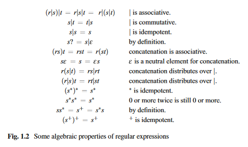

# Noter til materiale fra Introduction to Compiler Design + nogle lecture/lab slides

## Precedence and associativity


## Abstract Syntax Tree
Lexical -> tokenize
Parser -> parses tokens into a tree, that represents the structure of the code


 your "source code" is a stream of characters, tokenizing turns that into a stream of tokens (~words/numbers/etc.), then "parsing" based on grammatical rules turns the thing into a tree, the leaves of that tree are now the tokens previously mentioned and the branches of that tree are higher level constructs such as a statement that gives value to something or an expression that calculates some math formula. 

## Week 17a: Symbol Tables, Interpretation. Preface and chapters 3 and 4
### **Preface**
- Hand-written machine code will run faster than code written in a high-level language
- A program written in a high-level language is more versatile, as it can be translated into different machine languages thereby being able to run on different machines
- A good compiler will be able to get very close to the speed of hand-written machine code when translating well-structured programs

We split compilation in different phases. Each phase take the former phase's output as input except for the first phase. 

The phases:
1. Lexical analysis
    - Initial part of reading and analyzing program text.
    - The text is read and divided into tokens.
    - The tokens correspond to a symbol in the program language, could be a variable name, keyword (let, in etc.) or number.
    - Abbreviation: lexing
2. Syntax analysis
    - This phase takes the listt of tokens produced by lexing.
    - Syntax analysis uses the tokens to arrange them in a tree structure (syntax tree)
    - Abbreviation: parsing
3. Type checking
    - Analyses the syntax tree to determine if the program violates consistency requirements
    - Could be a variable is used but not declared or used in a context where the type doesn't make sense
4. Intermediate code generation
    - The program is translated to a simple machine-independent intermediate language
5. Register allocation
    - The symbolic variable names used in the intermediate code are
translated to numbers, each of which corresponds to a register in
the target machine code.
6. Machine code generation
    - The intermediate language is translated to assembly language for a specific machine architecture.
7. Assembly and linking
    - The assembly language code is translated into binary represen-
tation and addresses of variables, functions, etc., are determined

The first tree phases are called *front-end* of the compiler and the last three are called *back-end*.
Assembly and linking are typically done by programs supplied by the machine
or operating system vendor, and are hence not part of the compiler itself.

### **Chapter 3: Scopes and Symbol Tables**
### Scopes
In programming languages it is important to name items such as variables, functions and types. Each named item will have a declaration, where the name is a synonym for the item. This i called a *binding*.

*Scope*: a portion of the program where the name will be visible. (local declarations vs global declarations)

The scope of a declaration is a sub-tree of the syntax tree. The closest
declaration of a name is hence the declaration corresponding to the smallest sub-tree that encloses the use of the name.

Example:
```c
{
    int x = 1;
    int y = 2;
    {
        double x = 3.14159265358979;
        y += (int)x;
    }
    y += x;
}
```
The scope in the above code will vary from declaration to declaration. int x and int y will exist until the last closing bracket. A new scope is started by the second opening bracket. double x will only exist in between the second opening bracket and the first closing bracket.

### Symbol Tables
A symbol table is a table that **binds names to information** about the items the names are bound to.
We need a number of operations on symbol tables to accomplish this:
- We need an empty symbol table, in which no name is defined.
- We need to be able to bind a name to information about an item. In case the name
is already defined in the symbol table, the new binding takes precedence over the
old.
- We need to be able to look up a name in a symbol table to find the information
that the name is bound to. If the name is not defined in the symbol table, we need
to be told that.
- We need to be able to enter a new scope.
- We need to be able to exit a scope, reestablishing the symbol table to what it was
before the scope was entered.

### *Implementation of Symbol Tables*
There are many ways to implement symbol tables, but the most important distinction
between these is how scopes are handled.

This can be done using either a persitent/functional data structure or an imperative/destructively-updated data structure.

**Examples:**

*Simple Persistent Symbol Tables*

In functional programming languagues persistent data structures are the norm.
 For example, when a new element is
added to the front of a list or an element is taken off the front of the list, the old list still
exists and can be used elsewhere.

A list is a natural way to implement a symbol table in
a functional language: **A binding is a pair of a name and its associated information,
and a symbol table is a list of such pairs**.

The operations are implemented in the
following way:
1. empty
    - An empty symbol table is an empty list.
2. bind
    - A new binding (name/information pair) is added (consed) to the front of
the list.
3. lookup
    - The list is searched until a pair with a matching name is found.
    - The information paired with the name is then returned
    -  If the end of the list is
reached, an indication that this happened is returned instead. 
    - This indication can be made by raising an exception or by letting the lookup function
return a special value representing “not found”. This requires a type that
can hold both normal information and this special value, i.e., an option
type (SML, F#) or a Maybe type (Haskell).
4. enter
    - The old list is remembered, i.e., a reference is made to it.
5. exit
    - The old list is recalled, i.e., the above reference is used.

Instead of using a list, another functional approach to symbol tables is using functions: A symbol table
is quite naturally seen as a function from names to information. The operations are:
1. empty
    - An empty symbol table is a function that returns an error indication (or
raises an exception) no matter what its argument is.
2. bind
    - Adding a binding of the name n to the information i in a symbol table t
is done by defining a new symbol-table function t′ in terms t and the new
binding.
    - When t′ is called with a name n1 as argument, it compares n1
to n. If they are equal, t′ returns the information i.
    - Otherwise, t′ calls t
with n1 as argument and returns the result that this call yields.

bind example in ML (machine language)
```f#
{
    fun bind (n,i,t)
        = fn n1 => if n1=n then i else t n1
}
```
3. lookup
    - The symbol-table function is called with the name as argument.
4. enter
    - The old function is remembered (referenced)
5. exit
    - The old function is recalled (by using a reference)


</br>

*Simple Imperative Symbol Table*

Imperative symbol tables are natural to use if the compiler is written in an imperative
language. A simple imperative symbol table can be implemented as a stack, which
works in a way similar to the list-based functional implementation:

1. empty
    - An empty symbol table is an empty stack.
2. bind
    - A new binding (name/information pair) is pushed on top of the stack.
3. lookup
    - The stack is searched top-to-bottom until a matching name is found. The
information paired with the name is then returned.
    - If the bottom of the
stack is reached, we instead return an error-indication.
4. enter
    - We push a marker on the top of the stack.
5. exit
    - We pop bindings from the stack until a marker is found. This is also popped
from the stack.

Note that since the symbol table is itself a stack.

This is not quite a persistent data structure, as leaving a scope will destroy its
symbol table. For simple languages, this won’t matter, as a scope isn’t needed again
after it is exited. But language features such as classes, modules and lexical closures
can require symbol tables to persist after their scope is exited. In these cases, a real
persistent symbol table must be used, or the needed parts of the symbol table must
be copied and stored for later retrieval before exiting a scope.

</br>

### Efficiency issues

While all of the above implementations are simple, they all share the same efficiency
problem: Lookup is done by linear search, so the worst-case time for lookup is
proportional to the size of the symbol table.

A common solution to this problem is hashing: Names are hashed (processed)
into integers, which are used to index an array.

 Each array element is then a linear list
of the bindings of names that share the same hash code.

Given a large enough hash
table, these lists will typically be very short, **so lookup time is basically constant.**

Using hash tables complicates entering and exiting scopes somewhat. While each
element of the hash table is a list that can be handled like in the simple cases, doing
this for all the array-elements at every entry and exit imposes a major overhead.

### **Chapter 4: Interpretation**
*Any good software engineer will tell you that a compiler and an
interpreter are interchangeable.* - Tim Berners-Lee (1955)

After lexing and parsing, we have the abstract syntax tree of a program as a data
structure in memory. But a program needs to be executed, and we have not yet dealt
with that issue.

Interpretation is done
by a program called an interpreter, which takes the abstract syntax tree of a program
and executes it by inspecting the syntax tree to see what needs to be done.

**The interpreter is a function that takes an abstract syntax tree and a symbol
table as arguments and returns the value of the expression represented by the abstract
syntax tree.**

We will in this chapter assume that the symbol tables are **persistent**, so no explicit
action is required to restore the symbol table for the outer scope when exiting an
inner scope.

</br>

**Example of interpreter for an example language**


We need a vtable and an ftable, such that we can bind variables to their values and function names to the abstract syntax trees of their declarations.
 The
result of evaluating an expression is the value of the expression.


Explanation of each evaluation:

1. **num**
    - The value of a number is found as the value attribute to the node in the abstract
syntax tree.
2. **id**
    - The value of a variable is found by looking its name up in the symbol table
for variables (vtable)
    -  If the variable is not found in the symbol table, the lookup-
function returns the special value *unbound*. When this happens, an error is
reported and the interpretation stops.
    - Otherwise, it returns the value returned by
lookup.
3. $Exp_1 + Exp_2$
    - Both arguments are evaluated, then it is checked that they
are both integers.
    -  If they are, we return the sum of the two values.
    - Otherwise, we
report an error (and stop).
4. $Exp_1 < Exp_2$
    -  Requires that the arguments have the same type.
    - If that is the case, we
compare the values, otherwise we report an error.
5. *if $Exp_1$ then $Exp_2$ else $Exp_3$*
    - The condition must be a boolean.
    - If it is, we check if it
is true. If so, we evaluate the then-branch.
    -  Otherwise, we evaluate the else-branch.
    - If the condition is not a boolean, we report an error.
6. **id** ($Exps$)
    - At a function call, the function name is looked up in the function environment
to find its definition
    - If the function is not found in the environment, we report
an error.
    - Otherwise, we evaluate the arguments by calling Eval Exps and then call
Call Fun to find the result of the call.
7. `let` **id** = $Exp_1$ `in` $Exp_2$
    - A let-expression declares a new variable with an initial value defined by an
expression
    -  The expression is evaluated and the symbol table for variables is
extended using the function bind to bind the variable to the value. 
    - The extended
table is used when evaluating the body-expression, which defines the value of the
whole expression
    - Note that we do not explicitly restore the symbol table after exiting the scope of the let-expression. The old symbol table is implicitly pre-
served.
8. *Eval*$_{Exps}$
    - builds a list of the values of the expressions in the expression list.
    - The
notation is taken from SML and F#: A list is written in square brackets, and the infix
operator : : adds an element to the front of a list.


### Interpreting function calls

A function declaration explicitly declares the types of the arguments. When a function
is called, we must check that the number of arguments is the same as the declared
number, and that the values of the arguments match the declared types.

If this is the case, we build a symbol table that binds the parameter variables to
the values of the arguments and use this in evaluating the body of the function. The
value of the body must match the declared result type of the function.

### Advantages and Disadvantages of Interpretation
Once you have a abstract syntax tree, interpretation is often the simplest way of
executing a program. However, it is also a relatively slow way to do so.


## Week 17b: A Brief Introduction to Lexing + Parsing. Section 1.1; 2.1-2.3 + lecture/lab slides; Fasto grammar

### **Section 1.1 Regular Expressions**

The idea is that regular expressions that describe simple sets of strings can
be combined to form regular expressions that describe more complex sets of strings.

### Unspecified regular expressions
*r, s* and *t* in italics are used to denote unspecified regular expressions. (in this book at least)

When letters stand for themselves (i.e., in
regular expressions that describe strings that use these letters) we will use typewriter font, e.g., `a` or `b`. (`a` just means the string "a")

The letters *u, v* and *w* in italics will be used to denote unspecified
single strings, i.e., members of some language. 

As an example, `ab`*w* denotes any
string starting with `ab`. When we say, e.g., “The regular expression ``s``” we mean the regular expression that describes a single one-letter string “``s``”, but when we say “The regular expression *s*”, we mean a regular expression of any form which we just happen to call *s*. 

### L(*s*)
We use the notation L(*s*) to denote the language (i.e., set of strings)
described by the regular expression *s*. For example, L(``a``) is the set {“``a``”}.


To find L(*s*) for a given regular expression *s*, we use derivation: Rules that rewrite a regular expression into a string of letters.

These rules allow a single regular expression
to be rewritten into several different strings, so L(*s*) is the set of strings that *s* can be rewritten to using these rules.


As seen above "=>" denotes derivation.

### **Example of using derivation rules to find the language of a regualr expression**
*L*(`a`(`b`|`c`)) = {´ab´,´ac´} because `a`(`b`|`c`) => `a`(`b`) = `ab` and `a`(`b`|`c`) => `a`(`c`) = `ac`.

*L*(`a`(`b`|`c`)*) is infinite, as * denotes any number of concatenations (including zero). It contains any sequence of `a`*s* and `b`*s* or the empty sequence. 

For example, the string `ab` is in *L*((`a`|`b`)∗) because (`a`|`b`)∗ ⇒
(`a`|`b`)(`a`|`b`)∗ ⇒ `a`(`a`|`b`)∗ ⇒ `a`(`a`|``b``)(``a``|``b``)∗ ⇒ ``ab``(``a``|``b``)∗ ⇒ ``ab``.

### Parentheses and Precedence Rules
For regular expressions, we use the following conventions: ∗
binds tighter than concatenation (sammensætning f.eks. *st* or *ts*), which binds tighter than alternative (|). The example
``a``|``ab``∗ from above is, hence, equivalent to ``a``|(``a``(``b``∗)).



The | operator is associative and commutative. Concatenation is associative (but
obviously not commutative) and distributes over |.

### Shorthands
We use [ab01]
as a shorthand for a|b|0|1. Additionally, we can use interval notation to abbreviate
[0123456789] to [0–9]. We can combine several intervals within one bracket
and for example write [a–zA–Z] to denote all alphabetic letters in both lower
and upper case.

(0|1|2|3|4|5|6|7|8|9) (0|1|2|3|4|5|6|7|8|9)∗ = [0–9][0–9]∗ = [0–9]+. Since s∗ denotes zero or more occurrences of s, we needed to write the set of
digits twice to describe that one or more digits are allowed. 

s* = zero or more occurences

s+ = one ore more occurences

s? = zero or one occurence = *s*|$\epsilon$

The shorthand symbols + and ? bind with the same precedence as ∗.

If + is nested n deep, recursive expansion of s+ to ss∗ yields 2n −1 occurrences
of ∗ in the expanded regular expression. For example, (((a+)b)+c)+ expands to
aa∗b(aa∗b)∗c(aa∗b(aa∗b)∗c)∗.

### **Examples**

1. Keywords
    - A keyword like ``if`` is described by a regular expression that looks
exactly like that keyword, e.g., the regular expression if (which is the concate-
nation of the two regular expressions ``i`` and ``f``).
2. Variable names
    - In the programming language C, a variable name consists of let-
ters, digits and the underscore symbol and it must begin with a letter or underscore.
    - This can be described by the regular expression [a–zA–Z_][a–zA–Z_0–9]∗.
3. Integers
    - An integer constant is an optional sign followed by a non-empty sequence
of digits: [+-]?[0−9] +.
    - In some languages, a signed constant is not a single token,
but a concatenation of two tokens: the sign and an unsigned number constant.
This will usually allow whitespace between the sign and the number, which is not
possible with the above.
4. Floats
    - [+-]?((([0−9] +. [0−9] ∗ | . [0−9] +)([eE][+-]?[0−9] +)?)
| [0−9] + [eE][+-]?[0−9] +)
    - A floating-point constant can have an optional sign. After this, the mantissa
part is described as a sequence of digits followed by a decimal point and then
another sequence of digits. Either one (but not both) of the digit sequences can
be empty. Finally, there is an optional exponent part, which is the letter e (in
upper or lower case) followed by an (optionally signed) integer constant. If there
is an exponent part to the constant, the mantissa part can be written as an integer constant (i.e., without the decimal point).
    - We can make the description simpler if we make
the regular expression for floats also include integers, and instead use other means
of distinguishing integers from floats: [+-]?(([0−9] +(. [0−9] ∗)?|. [0−9] +)([eE][+-]?[0−9] +)?)
5. String constants
    - “([a−zA−Z0−9]|\[a−zA−Z])∗”
    - A string constant starts with a quotation mark followed by a
sequence of symbols and finally another quotation mark.


### **Section 2.1: Context-Free Grammars**
Like regular expressions, context-free grammars describe sets of strings, i.e., lan-
guages. Additionally, a context-free grammar also defines structure on the strings in
the language it defines.

A language is defined over some alphabet, for example the
set of tokens produced by a lexer or the set of alphanumeric characters. The symbols
in the alphabet are called terminals.

### **Section 2.2: Derivation**


### **Section 2.3: Operator Precedence**


## Week 18: Interpretation Continued; Type Checking. Chapter 5 and  "Compilers: Principles, Techniques, and Tools", section 6.5 (see DragonTypeUnification)


## Week 19a: Intermediate Code Generation. Chapter 6


##  Week 19b: Machine Code Generation. Chapter 7 (7.1-7.3)


## Week 20a: Optimizations. Chapter 7 (7.4), slides: compiler optimizations in Fasto; cursorily chapter 10 (read after lecture on liveness analysis)


## Week 20b: Liveness Analysis, Register Allocation. Chapter 8


## Week 21a: Lexical Analysis 1. Sections 1.1-1.6


## Week 21b: Lexical Analysis 2. Sections 1.7-1.10


## Week 22,23: Syntax Analysis. Section 2.1-2.12 and 2.13-2.17


## Week 24a: Function Calls. Sections 9.1-9.9. Sections on register allocation and calling conventions in MIPS module manual


## Week 24b: Preparation for Exam.
We'll do a detailed walk-through of sample solutions for a representative previous exam


## Week 25, 34: Exam
21/6 Ordinary exam: best of luck!

23/8 Re-Exam: hopefully not needed!